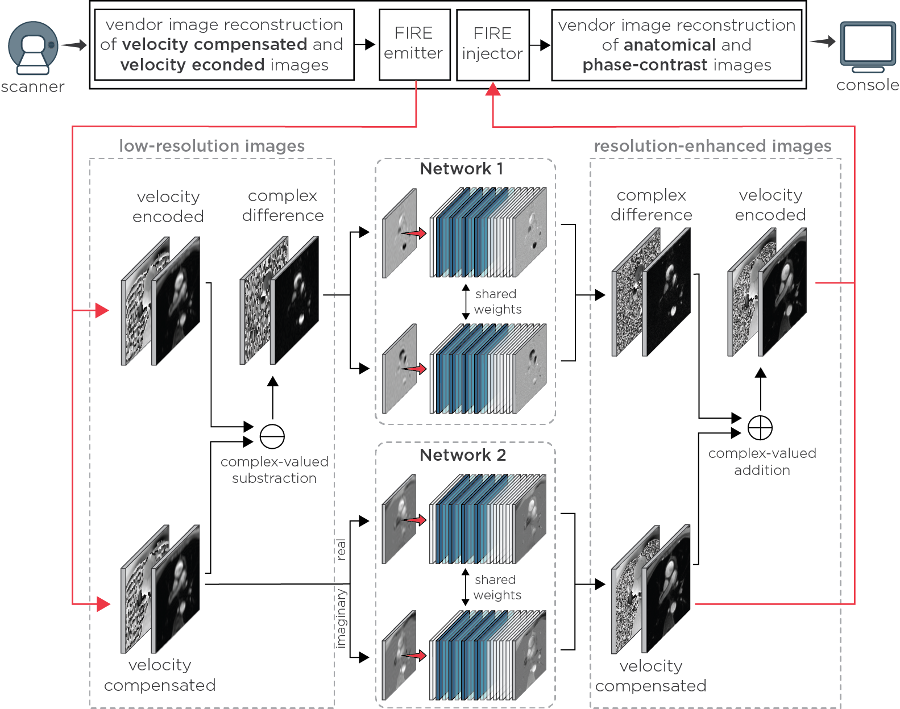

<table>
<tr>
<td></td>
<td></td>
<td></td>
<td></td>
<td></td>
</tr>
</table>

[[Harvard Dataverse](https://dataverse.harvard.edu/dataset.xhtml?persistentId=doi:10.7910/DVN/SLNTKB)]

   

# Accelerated Phase Contrast MRI with Use of Resolution Enhancement Generative Adversarial Neural Network 

## About 

    
     
    

    Velocity compensated and encoded images acquired with low resolution are reconstructed using the vendor reconstruction algorithm pipeline. The low-resolution images are sent to an external sever via a Framework for Image Reconstruction (FIRE) interface. Network 1 is used to enhance complex-difference images, which are obtained using complex-valued subtraction of velocity compensated and encoded images. Network 2 enhances velocity compensated images directly. Both networks enhance real and imaginary parts separately. The resolution-enhanced velocity compensated and encoded images, the latter obtained through complex-valued addition, are returned to the vendor pipeline to reconstruct anatomical and phase-contrast images.
    

      

